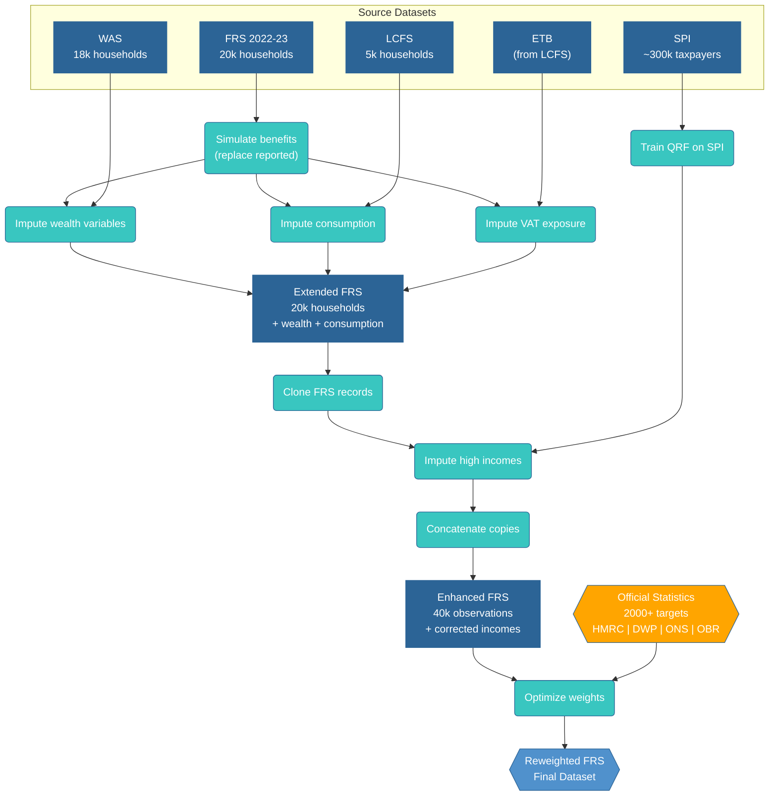

# Data Sources

PolicyEngine UK Data combines multiple UK government surveys to create comprehensive representative microdata. This page documents each data source, its purpose, and how to access it.

## Primary Sources

### Family Resources Survey (FRS)

**Publisher:** Department for Work and Pensions (DWP)

**Coverage:** ~20,000 UK households annually[^frs-sample]

**Purpose:** Main source of household demographics, income, and benefits data

**Variables include:**
- Demographics (age, gender, family composition)
- Employment and self-employment income
- Benefit receipt
- Housing costs and tenure
- Disability status
- Childcare arrangements

**Access:**
- [UK Data Service](https://beta.ukdataservice.ac.uk/)
- Requires registration (free for UK academics)
- Special license for non-academics

**In PolicyEngine:**
- Base dataset for all variants
- Provides household structure and demographics
- Used for 2022-23 survey year

**Limitations:**
- Income underreporting, especially at high incomes
- No wealth data
- Limited consumption data
- Sample size limits regional granularity

### Wealth and Assets Survey (WAS)

**Publisher:** Office for National Statistics (ONS)

**Coverage:** ~18,000 UK households biennially[^was-sample]

**Purpose:** Wealth variable imputations

**Variables include:**
- Property wealth
- Financial wealth
- Pension wealth
- Physical wealth
- Debt

**Access:**
- [UK Data Service](https://beta.ukdataservice.ac.uk/)
- Same registration as FRS

**In PolicyEngine:**
- Used to impute wealth variables in ExtendedFRS and EnhancedFRS
- Quantile regression forests predict wealth from FRS variables
- Maintains demographic correlations

**Limitations:**
- Biennial survey (less frequent than FRS)
- Wealth measurement challenges
- Sample size limitations

### Living Costs and Food Survey (LCFS)

**Publisher:** Office for National Statistics (ONS)

**Coverage:** ~5,000 UK households annually[^lcfs-sample]

**Purpose:** Consumption expenditure imputations

**Variables include:**
- Detailed consumption by category
- Food expenditure
- Housing costs
- Transport costs
- Recreation and culture

**Access:**
- [UK Data Service](https://beta.ukdataservice.ac.uk/)
- Open access (no registration required for recent years)

**In PolicyEngine:**
- Imputes consumption variables
- Supports VAT and consumption tax analysis
- QRF models predict consumption from FRS demographics

**Limitations:**
- Smaller sample size (~5k households)
- Diary-keeping burden may affect representativeness
- Some consumption underreporting

### Survey of Personal Incomes (SPI)

**Publisher:** HM Revenue & Customs (HMRC)

**Coverage:** All UK taxpayers (~30 million records, 1% sample released)[^spi-sample]

**Purpose:** Correct high-income underreporting

**Variables include:**
- Employment income
- Self-employment income
- Savings and dividend income
- Property income
- Pension income

**Access:**
- [HMRC Statistics](https://www.gov.uk/government/statistics/personal-incomes-statistics)
- Publically available aggregated tables
- Microdata available to approved researchers

**In PolicyEngine:**
- Enhances income distribution in EnhancedFRS
- Adds high-income observations missing from FRS
- QRF models impute full income profiles

**Strengths:**
- Administrative data (not survey-based)
- Complete coverage of taxpayers
- Accurate income reporting

**Limitations:**
- Only covers individuals with tax obligations
- No demographic variables beyond age
- 2-year publication lag

## Auxiliary Sources

### Effects of Taxes and Benefits on Household Income (ETB)

**Publisher:** Office for National Statistics (ONS)

**Based on:** LCFS data with imputed taxes and benefits

**Purpose:** VAT exposure rate imputations

**Variables include:**
- VAT-able consumption
- Effective VAT rates
- Tax and benefit burdens

**Access:**
- [ONS Publications](https://www.ons.gov.uk/peoplepopulationandcommunity/personalandhouseholdfinances/incomeandwealth/bulletins/theeffectsoftaxesandbenefitsonhouseholdincome/latest)
- Aggregated tables publicly available

**In PolicyEngine:**
- Imputes share of consumption subject to full VAT rate
- Enables accurate VAT policy analysis

### Official Statistics for Calibration

**Used for validation and calibration:**

#### HMRC Statistics
- Income by tax band
- National Insurance contributions
- Employment and self-employment income distributions
- Capital gains tax

**Source:** [HMRC Statistics](https://www.gov.uk/government/organisations/hm-revenue-customs/about/statistics)

#### DWP Benefit Statistics
- Benefit caseloads and expenditures
- Universal Credit statistics
- State Pension statistics

**Source:** [DWP Stat-Xplore](https://stat-xplore.dwp.gov.uk/)

#### OBR Forecasts
- Total tax revenues
- Total benefit expenditures
- Policy costings

**Source:** [OBR Publications](https://obr.uk/forecasts-in-depth/the-economy-forecast/)

#### ONS Demographics
- Population by age and region
- Household composition
- Tenure types

**Source:** [ONS Population Estimates](https://www.ons.gov.uk/peoplepopulationandcommunity/populationandmigration/populationestimates)

## Data Processing Pipeline



## Accessing Raw Data

### For Users

PolicyEngine UK Data handles data downloads automatically:

```python
from policyengine_uk_data import EnhancedFRS_2022_23

# Data downloads automatically on first use
dataset = EnhancedFRS_2022_23
```

Set `HUGGING_FACE_TOKEN` environment variable for authentication.

### For Developers

To rebuild from source data:

1. **Register with UK Data Service**
2. **Download FRS, WAS, LCFS** (tab-delimited format)
3. **Set paths in environment:**
   ```bash
   export FRS_RAW_DATA=/path/to/frs
   export WAS_RAW_DATA=/path/to/was
   export LCFS_RAW_DATA=/path/to/lcfs
   ```
4. **Build datasets:**
   ```bash
   make download  # Downloads public data (SPI, etc.)
   make data      # Builds all datasets
   ```

## Data Licensing and Usage

### FRS, WAS, LCFS
- **License:** UK Data Service End User License
- **Academic use:** Free with registration
- **Commercial use:** Requires separate license
- **Attribution:** Required

### SPI
- **License:** Open Government License
- **Use:** Free for any purpose
- **Attribution:** Required

### PolicyEngine UK Data Outputs
- **License:** AGPL-3.0
- **Use:** Free for any purpose
- **Attribution:** Appreciated
- **Sharing:** Derivative works must be open source

## Citation

When using PolicyEngine UK Data in research:

```
PolicyEngine. (2024). PolicyEngine UK Data [Software].
https://github.com/PolicyEngine/policyengine-uk-data

Based on:
- Family Resources Survey 2022-23, Department for Work and Pensions
- Wealth and Assets Survey, Office for National Statistics
- Living Costs and Food Survey, Office for National Statistics
- Survey of Personal Incomes, HM Revenue & Customs
```

## See Also

- [Methodology](methodology.ipynb) - How we process and combine these sources
- [Glossary](glossary.md) - Definitions of surveys and terms
- [Validation](validation/) - How outputs compare to official statistics

## References

[^frs-sample]: Department for Work and Pensions. (2023). *Family Resources Survey 2022/23*. Sample of approximately 19,000 households. [UK Data Service SN 9016](https://beta.ukdataservice.ac.uk/datacatalogue/series/series?id=200017).

[^was-sample]: Office for National Statistics. (2020). *Wealth and Assets Survey, Waves 1-7, 2006-2020*. Approximately 18,000 households per wave. [UK Data Service SN 7215](https://beta.ukdataservice.ac.uk/datacatalogue/studies/study?id=7215).

[^lcfs-sample]: Office for National Statistics. (2023). *Living Costs and Food Survey, 2022*. Sample of approximately 5,000 households. [UK Data Service SN 9114](https://beta.ukdataservice.ac.uk/datacatalogue/series/series?id=200017).

[^spi-sample]: HM Revenue & Customs. (2024). *Survey of Personal Incomes, 2020-21*. Based on administrative records of all UK taxpayers; 1% sample (~300,000 individuals) released for research. [HMRC Statistics](https://www.gov.uk/government/statistics/personal-incomes-statistics-to-2020-to-2021).